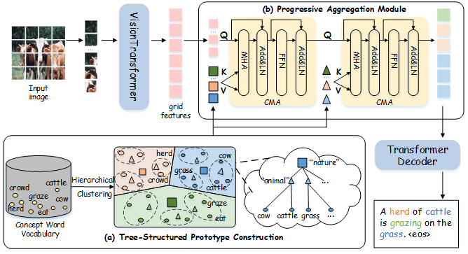

# PTSN: Progressive Tree-Structured Prototype Network


This repository contains the reference code for the <b>ACM MM2022</b> paper "Progressive Tree-Structured Prototype Network for End-to-End Image Captioning"
<p align="center">
  
</p>

<p align="center">
<a href="https://dl.acm.org/doi/abs/10.1145/3503161.3548024" target="_blank">Paper Access </a> |<a href="https://competitions.codalab.org/competitions/3221#results"> MSCOCO Leaderboard (TeamName:CMG) </a> | <a href="https://pan.baidu.com/s/1SSIj7HnFH79GzgERm9aDcA" target="_blank">Baidu Disk </a>
</p>


## Environment setup
* Python 3.6
* Pytorch 1.7.1 (strongly recommand)
* Numpy 1.19

## Data preparation
To run this code, pre-trained vision backbones, MSCOCO raw pictures and annotations should be downloaded. 
```bash
mkdir $DataPath/coco_caption/
mkdir $DataPath/resume_model/
mkdir $DataPath/saved_models/
mkdir PTSN/saved_transformer_models/
```
1. *_Pre-trained vision backbones:_* 

   please download [SwinT-B/16_22k_224x224](https://pan.baidu.com/s/1y1Ec3UlrKSI8IMtEs-oBXA) (password:swin) and put it in $DataPath/resume_model/ As for the other backbones(e.g. SwinT-L 384x384), you can download them at their [offical link](https://github.com/microsoft/Swin-Transformer).

2. *_Raw data_*:

   please download [train2014.zip](http://images.cocodataset.org/zips/train2014.zip), [val2014.zip](http://images.cocodataset.org/zips/val2014.zip) and [test2014.zip](http://images.cocodataset.org/zips/test2014.zip). Then unzip and put these files in $DataPath/coco_caption/IMAGE_COCO/ .
   
3. *_Annotations_*:

   please download [annotations](https://drive.google.com/drive/folders/1tJnetunBkQ4Y5A3pq2P53yeJuGa4lX9e) and put it in $DataPath/coco_caption/annotations/

4. *_Other data_*:

   please download [trained_models](https://pan.baidu.com/s/1SSIj7HnFH79GzgERm9aDcA) (passwd:ptsn) It includes word_embeds.pth, hyper_protos.pth, trained checkpoints and training logs. Put word_embeds.pth and hyper_protos.pth in PTSN/. Put checkpoints in $DataPath/saved_models/
   
## Inference procedure
To reproduce the results of our paper,  do the following two steps:
1. modify the /path/to/data in ./test_ptsn.sh into $DataPath 

2. please run the code below:
```bash
cd ./PTSN
sh test_ptsn.sh
```

## Training procedure
To train a Swin-B version of our PTSN model, do the following two steps:
1. modify the /path/to/data in ./train_ptsn.sh into $DataPath
2. please run the code below:
```bash
cd ./PTSN
sh train_ptsn.sh
```
Note that it takes 4 v100 GPUs and around 50 hours to train this model.

## Citation
To cite our paper, please use following BibTex:
```plain
@inproceedings{PTSN,
  author    = {Pengpeng Zeng and
               Jinkuan Zhu and
               Jingkuan Song and
               Lianli Gao},
  title     = {Progressive Tree-Structured Prototype Network for End-to-End Image
               Captioning},
  booktitle = {ACM MM},
  pages     = {5210--5218},
  year      = {2022},
}
```
